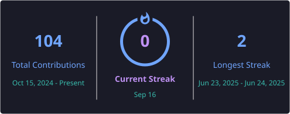

<h1 align="center">👋 Hi, I'm Sarvesh Kumar Maurya</h1>

<h3 align="center">
🎓 BCA – Data Science & AI | 📊 Aspiring Data Analyst | 🤖 AI & ML 
</h3>

<p align="center">
  
</p>

<p align="center">
  
</p>

---

## 🧑‍💻 About Me

🎓 BCA student specializing in **Data Science & Artificial Intelligence**

📊 Aspiring **Data Analyst** with hands-on experience in data cleaning,
EDA, visualization and dashboard development.

🐍 Working with **Python, Pandas, NumPy & Scikit-learn**

📈 Building dashboards using **Power BI & Excel**

🗄️ Practicing **SQL & MySQL**

🤖 Interested in **Machine Learning, AI and Predictive Analytics**

💡 Passionate about solving real-world problems using data.

---

## 🎓 Education

### Shri Ram Swaroop Memorial University
**BCA – Data Science & Artificial Intelligence**

📍 Lucknow, Uttar Pradesh

⭐ **CGPA: 8.73 / 10**

---

## 💼 Experience

### 📊 Data Analyst Intern — Elevate Labs

- 🐍 Cleaned and structured raw datasets using Python
- 🔎 Performed Exploratory Data Analysis (EDA)
- 📊 Built Power BI dashboards
- 📑 Automated Excel reports
- 💡 Converted business questions into analytical insights

---

### 🤖 Artificial Intelligence Intern — Codesoft

- 💬 Developed an AI chatbot using Python & NLP
- 🎬 Built a Movie Recommendation System
- 🎮 Developed an AI Tic-Tac-Toe game
- 🧠 Worked with model training and predictive analytics

---

# 🚀 Featured Projects

<table>
<tr>

<td width="50%">

<h3>📰 Fake News Detector</h3>

<p>
Machine Learning based application that predicts whether a news article
is <b>Real or Fake</b>.
</p>

<b>Tech Stack:</b>

🐍 Python  
📊 Pandas  
🤖 Scikit-learn  
🧠 NLP  
🌐 Streamlit

<br>

<a href="https://github.com/Sarvesh151/fake_nesw_detecter">

</a>

</td>

<td width="50%">

<h3>🎬 Movie Recommendation System</h3>

<p>
A recommendation system that suggests movies using machine learning
and movie similarity techniques.
</p>

<b>Tech Stack:</b>

🐍 Python  
📊 Pandas  
🤖 Machine Learning  
🎯 Recommendation System

<br>

<a href="https://github.com/Sarvesh151">

</a>

</td>

</tr>
</table>

---

# 🛠️ Tech Stack

### 👨‍💻 Programming Languages

<p>


</p>

### 📊 Data Science & ML

<p>


</p>

### 📈 Data Analytics

<p>


</p>

### 🧰 Tools

<p>


</p>

---

# 📊 GitHub Analytics

<p align="center">
  
  
</p>

---

# 🔥 GitHub Streak

<p align="center">
  
</p>

---

# 📈 Contribution Activity

<p align="center">
  
</p>

---

# 🏆 Certifications

🏅 Data Analytics Virtual Internship — Elevate Labs

🏅 Artificial Intelligence Internship — Codesoft Pvt. Ltd.

🏅 Python for Data Science — IBM SkillsBuild

🏅 SQL and Relational Database — IBM SkillsBuild

---

# 🧠 Currently Learning

```text
🐍 Advanced Python
📊 Data Analytics
🤖 Machine Learning
🧠 Artificial Intelligence
🗄️ SQL & Database Management
📈 Power BI
📊 Statistical Analysis
🚀 Model Deployment
